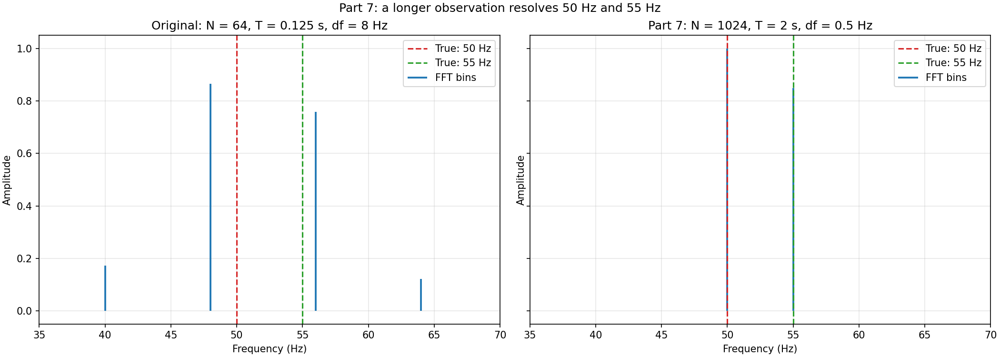

# Answers to the Guided Worksheet

## Part 1: Before running anything

1. An FFT decomposes a uniformly sampled signal into discrete frequency bins. Its
   amplitude spectrum indicates how strongly each represented frequency is
   present in the sampled data. It describes the samples that were acquired, so
   poor sampling can produce a misleading spectrum.

2. The three sampling quantities have different meanings:

   - The **sampling rate** $f_s$ is the number of samples acquired per second.
   - The **Nyquist frequency** $f_N=f_s/2$ is the highest frequency that can be
     represented without aliasing, assuming the signal contains no frequencies
     at or above that limit.
   - The **frequency resolution**, or FFT-bin spacing, is
     $\Delta f=f_s/N=1/T$. It determines how closely spaced the frequencies
     represented by adjacent FFT bins are.

3. The FFT used by this project treats sample index as time through
   $t_n=n\Delta t$, with one constant $\Delta t$. If the time intervals are not
   uniform, the usual FFT-bin frequencies no longer correspond correctly to the
   observations. Nonuniform data must first be handled with an appropriate
   resampling method or a transform designed for irregular samples.

## Part 2: Build and run

Running `make run` creates these files:

1. CSV output:

   - `output/good_sampling_signal.csv`
   - `output/good_sampling_spectrum.csv`
   - `output/undersampled_signal.csv`
   - `output/undersampled_spectrum.csv`
   - `output/short_record_signal.csv`
   - `output/short_record_spectrum.csv`
   - `output/coupled_oscillators_time.csv`
   - `output/coupled_oscillators_spectrum.csv`

2. `src/sampling_demo.c` studies pure sampling issues: adequate sampling, aliasing, and limited frequency resolution.

3. `src/coupled_oscillators_fft.c` studies the mechanics problem of two coupled masses and springs.

4. In the well-sampled case, the reported peaks are **50 Hz** with amplitude 1.0 and **120 Hz** with amplitude 0.7.

## Part 3: Sampling and aliasing

1. The undersampled case uses $f_s=128\,\mathrm{Hz}$.

2. Its Nyquist frequency is

   $$
   f_N=\frac{f_s}{2}=\frac{128\,\mathrm{Hz}}{2}=64\,\mathrm{Hz}.
   $$

3. The $120\,\mathrm{Hz}$ component is above the $64\,\mathrm{Hz}$ Nyquist
   frequency. There are therefore too few samples per cycle to identify it
   uniquely, so it cannot be reconstructed faithfully from these samples.

4. The generated spectrum confirms a peak at **8 Hz**, in addition to the correctly represented 50 Hz peak.

5. Sampling observes a sinusoid only at times $t_n=n/f_s$. Frequencies that differ by an integer multiple of $f_s$ can produce the same discrete sample sequence, apart from phase or sign. In this case,

   $$
   f_{\mathrm{alias}}=|120-128|\,\mathrm{Hz}=8\,\mathrm{Hz}.
   $$

   More explicitly,
   $\sin(2\pi 120n/128)=-\sin(2\pi 8n/128)$. The one-sided amplitude spectrum
   discards that sign/phase distinction, so the sampled 120 Hz oscillation is
   indistinguishable from an 8 Hz component and appears as a false low-frequency
   peak.

## Part 4: Frequency resolution

1. The signal contains components at 50 Hz and 55 Hz, separated by 5 Hz.

2. Here $N=64$, $f_s=512\,\mathrm{Hz}$, and
   $\Delta t=1/f_s$. Thus,

   $$
   T=N\Delta t=\frac{64}{512}\,\mathrm{s}=0.125\,\mathrm{s}.
   $$

3. The FFT-bin spacing is

   $$
   \Delta f=\frac{f_s}{N}=\frac{512}{64}\,\mathrm{Hz}
   =8\,\mathrm{Hz}=\frac{1}{T}.
   $$

4. The components are only 5 Hz apart, less than one 8 Hz bin. They cannot form
   two clean, independently resolved peaks on this frequency grid. In the
   actual output they blend into one dominant local peak at 48 Hz.

5. I would increase the **total acquisition time**. Since
   $\Delta f=1/T$, a longer observation directly decreases the FFT-bin spacing.
   Changing the plotting tool or file format can alter presentation or storage,
   but cannot add frequency information that was not acquired.

## Part 5: Coupled oscillators

1. With wall-spring constant $k$ and coupling-spring constant $k_c$, the code
   solves

   $$
   m\ddot{x}_1=-(k+k_c)x_1+k_cx_2,
   $$

   $$
   m\ddot{x}_2=k_cx_1-(k+k_c)x_2.
   $$

2. These equations describe two identical masses. Each mass is attached to a
   fixed wall by a spring of constant $k$, and a third spring of constant $k_c$
   couples the masses to each other.

3. The normal modes are:

   - **In-phase:** $x_1=x_2$. The coupling spring is not stretched, and
     $f_{\mathrm{in}}=(2\pi)^{-1}\sqrt{k/m}$.
   - **Out-of-phase:** $x_1=-x_2$. The coupling spring contributes additional
     restoring force, and
     $f_{\mathrm{out}}=(2\pi)^{-1}\sqrt{(k+2k_c)/m}$.

4. The initial condition is $x_1=0.10\,\mathrm{m}$ and $x_2=0$, with both
   velocities zero. It is not a pure normal-mode displacement; it is a
   superposition of the in-phase and out-of-phase modes. Consequently,
   $x_1(t)$ contains both mode frequencies and its FFT has two important peaks.

5. The analytical normal-mode frequencies provide an independent benchmark for
   the entire numerical pipeline: equations, ODE integration, uniform sampling,
   and FFT analysis. Agreement supports the implementation, while a significant
   discrepancy could reveal a modeling, integration, sampling, or FFT error.

## Part 6: Plot inspection

1. Aliasing is easiest to see in the **undersampled panel of
   `plots/sampling_spectra.png`**. It shows the 120 Hz component folded to 8 Hz,
   while the 50 Hz component remains at 50 Hz.

2. Limited resolution is easiest to see in the **short-record panel of
   `plots/sampling_spectra.png`**. The 50 Hz and 55 Hz inputs do not appear as
   two distinct peaks; the program reports a single dominant peak at 48 Hz.

3. Yes. In `plots/coupled_oscillators_spectrum.png`, the numerical peaks line
   up closely with the theoretical reference frequencies:

   | Mode | Theory (Hz) | Measured FFT bin (Hz) | Difference (Hz) |
   | --- | ---: | ---: | ---: |
   | In-phase | 0.79577 | 0.79688 | +0.00111 |
   | Out-of-phase | 0.99392 | 0.99219 | -0.00173 |

4. The observation lasts 128 s, so the FFT only evaluates frequencies on bins
   separated by $1/128=0.0078125\,\mathrm{Hz}$. A theoretical frequency will
   normally fall between bins. Finite record length also causes spectral
   leakage, and the numerical ODE solver introduces much smaller tolerance and
   roundoff errors. Here the offsets are below one FFT-bin spacing, so the
   agreement is good.

## Part 7: Small code modification

I chose **Option B: change the observation time**.

1. I tested changing the `short_record` sample count from $N=64$ to $N=1024$
   while retaining $f_s=512\,\mathrm{Hz}$ and therefore
   $\Delta t=1/512\,\mathrm{s}$. This increases the record length from
   0.125 s to

   $$
   T=N\Delta t=1024\left(\frac{1}{512}\right)\mathrm{s}=2\,\mathrm{s}.
   $$

2. Before rerunning, I predicted that the bin spacing would decrease from 8 Hz
   to

   $$
   \Delta f=\frac{1}{T}=0.5\,\mathrm{Hz}.
   $$

   I therefore expected separate peaks at 50 Hz and 55 Hz, ten FFT bins apart.

3. The rerun matched the prediction: it reported a 50 Hz peak with amplitude
   1.0000 and a 55 Hz peak with amplitude 0.8500. The longer record therefore
   makes the two frequencies clearly distinguishable. This test was compiled
   from a temporary transformed copy, so the original tutorial source remains
   unchanged.

   

   In the left panel, the 8 Hz bin spacing merges the two inputs into one
   dominant peak near 48 Hz. In the right panel, the 0.5 Hz bin spacing places
   distinct bins at 50 Hz and 55 Hz, clearly resolving both components.

## Part 8: Reflection

This project showed me that an FFT spectrum depends as much on the measurement
strategy as on the underlying physical signal: sampling too slowly causes
aliasing, whereas observing for too little time limits frequency resolution. I would
extend the project with window functions and a noisy signal so that one could
estimate leakage and peak detectability.
