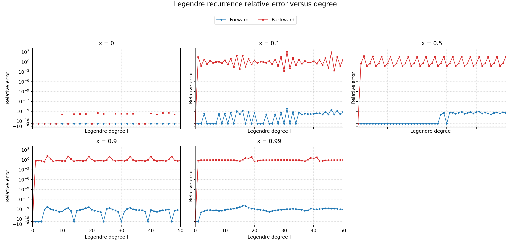
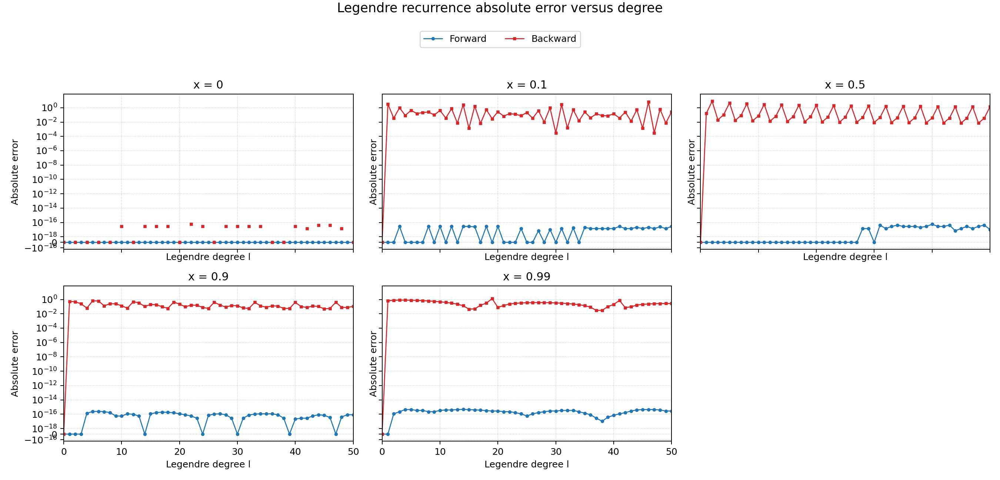

# Legendre recurrence stability

This exercise compares forward and backward evaluation of the ordinary Legendre
polynomials with a high-precision reference for degrees
\(\ell=0,\ldots,50\).  The tested arguments are

\[
x\in\{0,\ 0.1,\ 0.5,\ 0.9,\ 0.99\}.
\]

## Implemented methods

The Legendre recurrence is

\[
(n+1)P_{n+1}(x)=(2n+1)xP_n(x)-nP_{n-1}(x),
\qquad P_0(x)=1,\quad P_1(x)=x.
\]

### Forward recurrence

`ForwardRecurrence.h` starts with \(P_0=1\) and \(P_1=x\), then evaluates

\[
P_n(x)=\frac{(2n-1)xP_{n-1}(x)-(n-1)P_{n-2}(x)}{n}
\]

using standard IEEE 754 `double` arithmetic.

### High-precision reference

`HighPrecision.h` evaluates the same recurrence using MPFR with 256-bit
precision and round-to-nearest operations.  Only the final value is converted
to `double`.  This makes the rounded high-precision result the reference
against which the two double-precision recurrences are compared.

### Backward recurrence and normalization

`BackwardRecurrence.h` uses arbitrary terminal values

\[
u_{\ell+1}=0,\qquad u_\ell=1,
\]

and propagates downward using the correctly rearranged recurrence

\[
u_{n-1}=\frac{(2n+1)xu_n-(n+1)u_{n+1}}{n}.
\]

The generated solution is rescaled so that its degree-zero value is one.
Because the unscaled target value is \(u_\ell=1\), the returned candidate is
\(1/u_0\).  This normalization fixes only an overall multiplicative constant;
it cannot remove the unwanted independent solution introduced by the arbitrary
terminal conditions.

## Errors and results

For an approximation \(\widehat P_\ell\) and high-precision reference
\(P_\ell^{\rm ref}\), the saved errors are

\[
E_{\rm abs}=|\widehat P_\ell-P_\ell^{\rm ref}|,
\qquad
E_{\rm rel}=\frac{E_{\rm abs}}{|P_\ell^{\rm ref}|}.
\]

The relative error is recorded as `nan` when the reference is exactly zero.
This occurs for odd \(\ell\) at \(x=0\), since \(P_\ell(0)=0\).  For the same
cases, the arbitrary backward sequence has \(u_0=0\), so its normalization
fails and produces a non-finite result.  These points are omitted from the
plotted curves rather than being displayed as finite errors.

The largest errors over \(0\leq\ell\leq50\) in the regenerated data are:

| \(x\) | max forward absolute | max forward relative | max backward absolute | max backward relative |
|---:|---:|---:|---:|---:|
| 0 | 0 | 0 for nonzero references | non-finite for odd \(\ell\) | undefined for odd \(\ell\) |
| 0.1 | \(2.78\times10^{-17}\) | \(6.92\times10^{-15}\) | \(6.48\) | \(1.40\times10^3\) |
| 0.5 | \(5.55\times10^{-17}\) | \(8.11\times10^{-16}\) | \(7.88\) | \(63.0\) |
| 0.9 | \(2.50\times10^{-16}\) | \(5.57\times10^{-15}\) | \(0.636\) | \(15.5\) |
| 0.99 | \(4.72\times10^{-16}\) | \(1.11\times10^{-14}\) | \(1.29\) | \(7.66\) |

The forward absolute errors remain at roughly \(10^{-17}\) to \(10^{-16}\),
consistent with accumulated double-precision rounding.  Relative-error spikes
can occur where the polynomial itself is close to zero, even when the absolute
error is small.  The backward results are generally inaccurate by comparison.





The complete numerical values are in `legendre_comparison.csv`.

## Why forward succeeds and arbitrary backward recurrence fails

A second-order three-term recurrence has a two-dimensional solution space.
Thus, two independent sequences satisfy the same recurrence.  Floating-point
roundoff or arbitrary starting values generally introduce a mixture of both
solutions.

Miller's algorithm is effective when the wanted sequence is the minimal
solution in the direction of backward propagation.  Starting sufficiently far
away and recurring backward then suppresses the unwanted component relative to
the wanted one; a known value can subsequently fix the normalization.

For ordinary \(P_\ell(x)\) with \(|x|<1\), the two independent solutions are
oscillatory and have comparable algebraic size as \(\ell\) increases.  There is
no clean dominant/minimal separation that makes arbitrary backward terminal
data converge to \(P_\ell\).  Normalizing at \(P_0=1\) therefore does not select
the correct solution.  This explains both observations in the plots: forward
recurrence is stable for these tested values, while the arbitrary backward
recurrence generally does not recover \(P_\ell\).

## Connection with spherical harmonics

For \(m=0\), the spherical harmonic is

\[
Y_{\ell 0}(\theta,\phi)
=\sqrt{\frac{2\ell+1}{4\pi}}\,P_\ell(\cos\theta).
\]

It is independent of \(\phi\).  If the computed Legendre polynomial has error
\(\Delta P_\ell\), then

\[
|\Delta Y_{\ell0}|
=\sqrt{\frac{2\ell+1}{4\pi}}\,|\Delta P_\ell|.
\]

Where \(P_\ell(\cos\theta)\neq0\), the relative errors are identical:

\[
\frac{|\Delta Y_{\ell0}|}{|Y_{\ell0}|}
=\frac{|\Delta P_\ell|}{|P_\ell|}.
\]

At a zero of the polynomial, both \(Y_{\ell0}\) and the denominator of the
relative error vanish, so absolute error is the meaningful quantity.

## Reproducing the experiment

If MPFR and GMP are already installed system-wide:

```bash
gcc -std=c11 -O2 -Wall -Wextra -Wpedantic \
    LegendreStability.c -lmpfr -lgmp -lm -o LegendreStability
./LegendreStability
python3 plot_legendre_errors.py
```

If they are unavailable, `install_mpfr.sh` installs a private copy below this
directory; source `activate_mpfr.sh` before compiling.  Custom test arguments
can also be supplied to the executable, for example
`./LegendreStability 0.2 0.75`.
